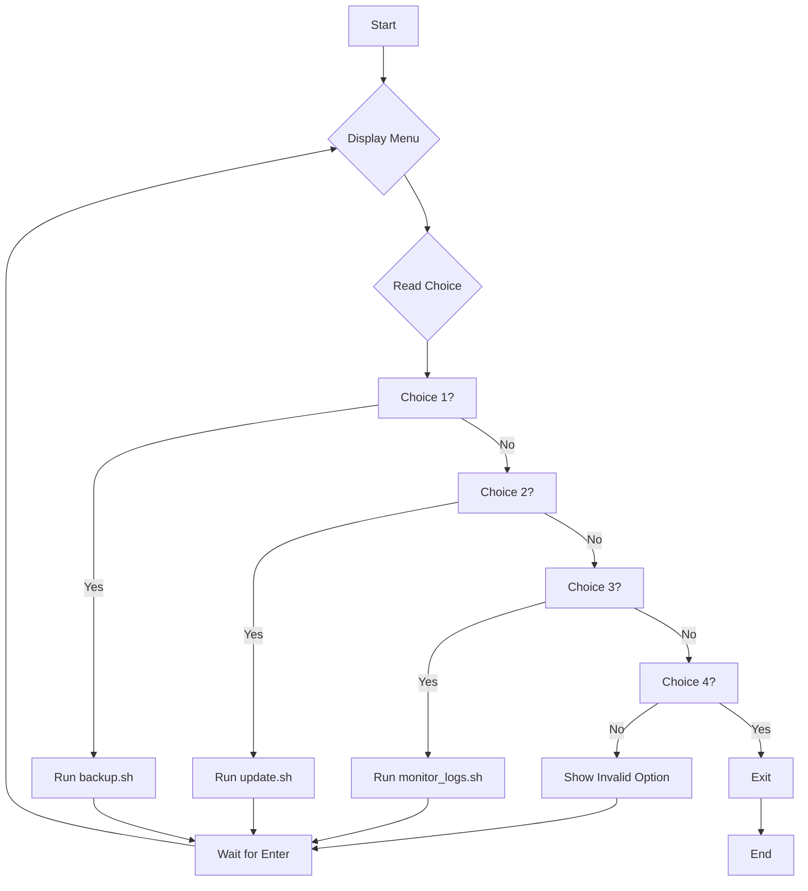

# Linux Maintenance Suite

This repository is my submission for the Capstone Project. It is a suite of Bash scripts designed to automate common system maintenance tasks on a Linux (Ubuntu/Debian-based) system.

This project is designed to be run either directly on a host machine or as a self-contained Docker container.

## Features

* **Interactive Menu:** An easy-to-use menu (`main.sh`) to run all tasks.
* **Automated Backups:** Creates a timestamped backup of your `Documents` folder.
* **System Updater:** Safely updates package lists, upgrades all installed packages, and cleans up old dependencies.
* **Log Monitor:** Quickly scans your `syslog` for lines containing "ERROR".
* **Full Logging:** All actions are automatically recorded in the `logs/maintenance.log` file.

## How to Run (Method 1: Local Host)

1.  Clone this repository.
2.  Navigate into the `linux-maintenance-suite` directory.
3.  Run the main menu (you will be asked for your 'sudo' password for some tasks):

    ```bash
    bash main.sh
    ```
4.  Follow the on-screen prompts.

## How to Run (Method 2: Docker Container)

This is the recommended way to run the suite, as it's isolated and portable. This uses the Docker concepts from the course modules.

1.  **Build the Docker image:**
    ```bash
    docker build -t maintenance-suite .
    ```

2.  **Run the container:**
    This command runs the container in interactive mode (`-it`), mounts your home directory's log files into the container, and mounts your home directory for backups.
    ```bash
    docker run -it --rm \
      -v /var/log:/var/log:ro \
      -v /home/uvaers/Documents:/home/uvaers/Documents:ro \
      -v /home/uvaers/backups:/home/uvaers/backups \
      maintenance-suite
    ```
    * `--rm`: Automatically deletes the container when you exit.
    * `-v /var/log...:ro`: Mounts your system's logs read-only (`ro`).
    * `-v /home/uvaers/Documents...:ro`: Mounts your Documents read-only for backing up.
    * `-v /home/uvaers/backups...`: Mounts your backups folder so the script can write to it.

## Software Design (UML)

As per the SDLC and UML modules, the flow of the `main.sh` script can be represented by the following UML Activity Diagram.



## Scripts Included

* `main.sh`: The main menu you run.
* `backup.sh`: Handles the backup process.
* `update.sh`: Runs `apt update`, `upgrade`, and `autoremove`.
* `monitor_logs.sh`: Checks `/var/log/syslog` for errors.
* `Dockerfile`: Builds the portable Docker container.
* `.gitignore`: Tells Git to ignore the `logs/` directory.

## Credits

Done by- Nishant Kumar Jena[2241010042]
